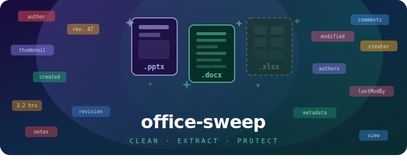

[](https://badge.fury.io/js/office-sweep)
[](https://opensource.org/licenses/MIT)

> Remove metadata, comments, notes, and other artifacts from Office files. Extract assets like images. Supports `.pptx` and `.docx`, with more formats planned.

## Why?

Office files carry hidden baggage — author names, edit timestamps, revision history, presenter notes, embedded comments, and thumbnail previews. When you share a file externally, this metadata can leak sensitive information. **office-sweep** strips it all out programmatically, so you can clean files before distribution, as part of a CI pipeline, or in any Node.js workflow.

You can also **extract** embedded assets like images from your documents.

## Install

```bash
npm install office-sweep
```

## Quick start

### Remove metadata from a PowerPoint

```typescript
import { officeSweep } from "office-sweep";

await officeSweep("presentation.pptx", {
  remove: {
    destinationFilePath: "presentation-clean.pptx",
    ppt: {
      totalTime: true,
      core: {
        title: true,
        creator: true,
        lastModifiedBy: true,
        revision: true,
        created: true,
        modified: true,
      },
      thumbnail: true,
      notes: true,
      comments: { modern: true, legacy: true },
      authors: true,
      view: true,
    },
  },
});
```

### Remove comments from a Word document

```typescript
await officeSweep("document.docx", {
  remove: {
    destinationFilePath: "document-clean.docx",
    word: {
      comments: true,
    },
  },
});
```

### Extract images from a presentation

```typescript
const result = await officeSweep("presentation.pptx", {
  extract: {
    destinationFolderPath: "./output",
    images: true,
  },
});

console.log(result.images);
// [{ name: "image1.png", path: "/output/images/image1.png", slideIndexes: [0, 2] }]
```

## API

### `officeSweep(sourcePath, options)`

| Parameter    | Type           | Description                    |
| ------------ | -------------- | ------------------------------ |
| `sourcePath` | `string`       | Path to the source Office file |
| `options`    | `SweepOptions` | Configuration object           |

Use **either** `remove` or `extract` in a single call — not both.

### Options

```typescript
type SweepOptions = {
  remove?: {
    destinationFilePath: string;
    ppt?: { /* PowerPoint-specific options */ };
    word?: { /* Word-specific options */ };
  };
  extract?: {
    destinationFolderPath: string;
    images?: boolean;
  };
};
```

### PowerPoint options (`remove.ppt`)

| Option                      | Type      | Description                                              |
| --------------------------- | --------- | -------------------------------------------------------- |
| `totalTime`                 | `boolean` | Remove total editing time                                |
| `core.title`                | `boolean` | Remove the presentation title                            |
| `core.creator`              | `boolean` | Remove the original author name                          |
| `core.lastModifiedBy`       | `boolean` | Remove the last editor's name                            |
| `core.revision`             | `boolean` | Remove the revision count                                |
| `core.created`              | `boolean` | Remove the creation timestamp                            |
| `core.modified`             | `boolean` | Remove the last-modified timestamp                       |
| `thumbnail`                 | `boolean` | Remove the thumbnail preview image                       |
| `notes`                     | `boolean` | Remove all presenter notes                               |
| `comments.modern`           | `boolean` | Remove modern comments (Office 2018+ spec)               |
| `comments.legacy`           | `boolean` | Remove legacy comments (Office 2006 spec)                |
| `authors`                   | `boolean` | Remove the authors list                                  |
| `view`                      | `boolean` | Remove saved view/window settings                        |
| `image.metadata`            | `boolean` | Remove metadata embedded in images                       |
| `image.hanging`             | `boolean` | Remove unused/orphaned images                            |

### Word options (`remove.word`)

| Option     | Type      | Description           |
| ---------- | --------- | --------------------- |
| `comments` | `boolean` | Remove all comments   |

### Extract options (`extract`)

| Option                  | Type      | Description                                    |
| ----------------------- | --------- | ---------------------------------------------- |
| `destinationFolderPath` | `string`  | Output folder (an `images/` subfolder is created) |
| `images`                | `boolean` | Extract all embedded images                    |

### Return value

When using `remove`, returns `{}` on success.

When using `extract`, returns:

```typescript
{
  success: true,
  images: Array<{
    name: string;         // Filename, e.g. "image1.png"
    path: string;         // Absolute path to extracted file
    slideIndexes: number[]; // Which slides reference this image
  }>
}
```

## Supported formats

| Format | Remove metadata | Extract images |
| ------ | :-------------: | :------------: |
| `.pptx` | ✅ | ✅ |
| `.docx` | ✅ | — |
| `.xlsx` | 🔜 Planned | 🔜 Planned |

## Use cases

- **Pre-distribution cleanup** — Strip author names, comments, and notes before sending files to clients or publishing externally.
- **CI/CD pipelines** — Automate metadata removal as a build step for generated reports or slide decks.
- **Privacy compliance** — Ensure internal metadata doesn't leak in shared documents.
- **Asset extraction** — Pull all images from a presentation for reuse in other projects.

## License

MIT © [Marcdj-02](https://github.com/Marcdj-02)